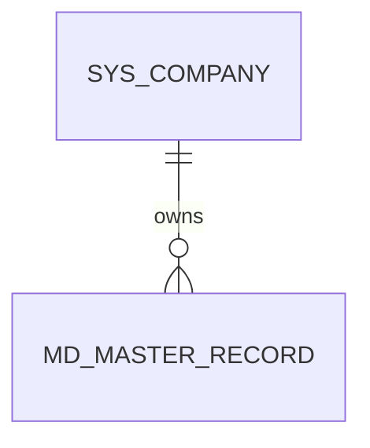

# MD 資料結構

WU-MD-001 為模組與權限基線，沒有新增資料表或 migration。後續主檔表均須有 `company_id`、審計與版本欄位，並採用共用 EF 公司篩選；相關工作單元建立實體時補入 ER 圖與 `REQ_DS43`。

```mermaid
erDiagram
    SYS_COMPANY ||--o{ MD_MASTER_RECORD : owns
```

`MD_MASTER_RECORD` 為後續主檔的概念佔位，並非本輪建立的實體或表。
